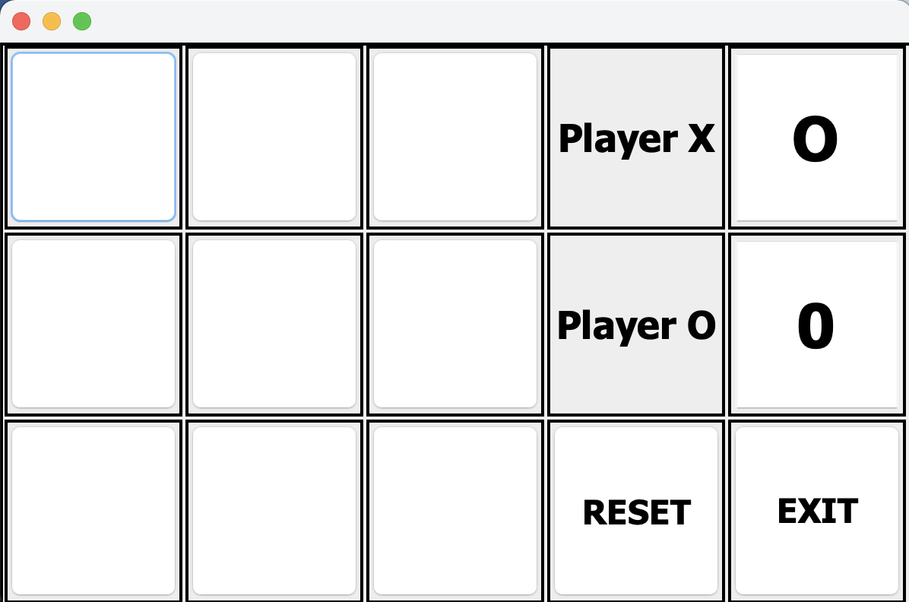
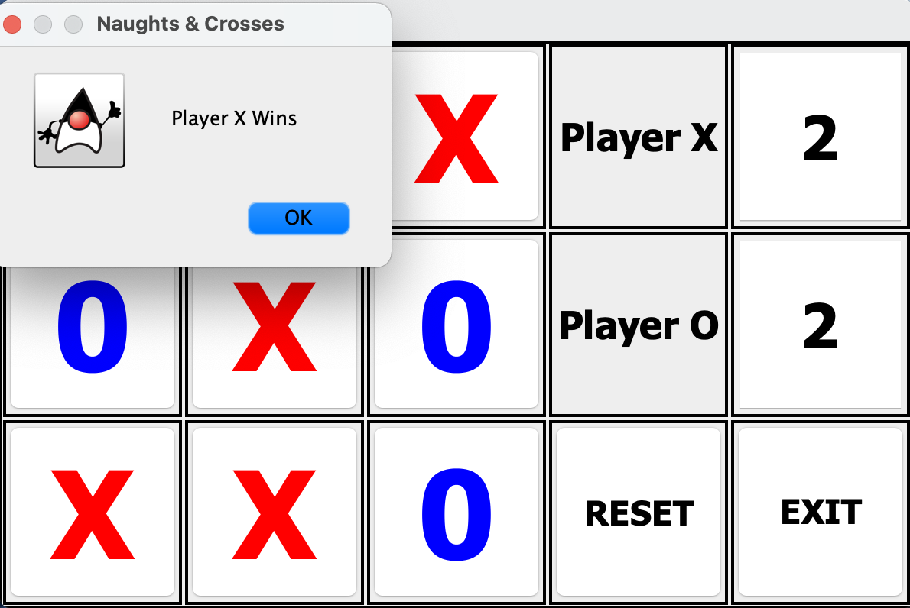

# Naughts and Crosses

A simple game of Naughts and Crosses to practice OOP (Object-Orientated Programming) in Java.

 

The game features a basic GUI (Graphical User Interface) comprising of:
- A 3 x 3 grid to play the game
- Player X and Player 0's win total
- A game reset button
- A exit button to close the game application

 

---

 

 

 

---

 

## Motivation Behind Mini Project

Due to work and life events, I did not have the oppertunity to code for a while. This mini project provided me with a good oppertunity to practice Object Orientated Programming (OOP) utilising the JAVA programming language.
